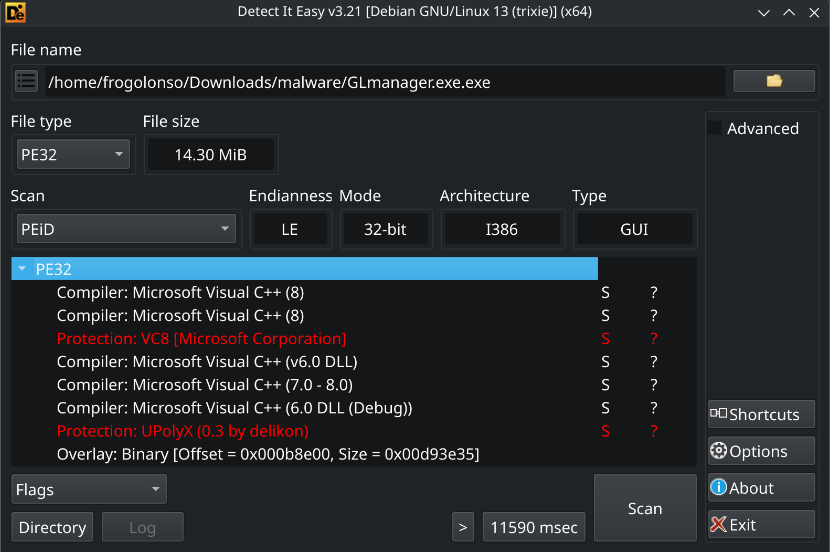
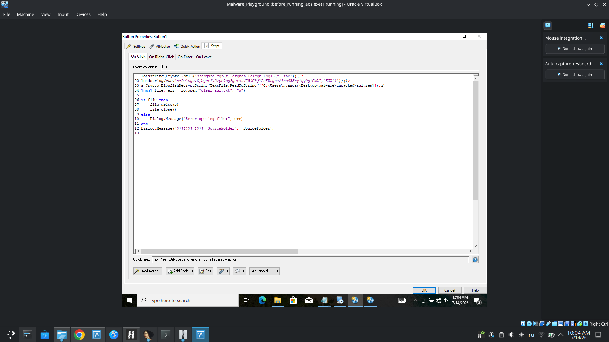
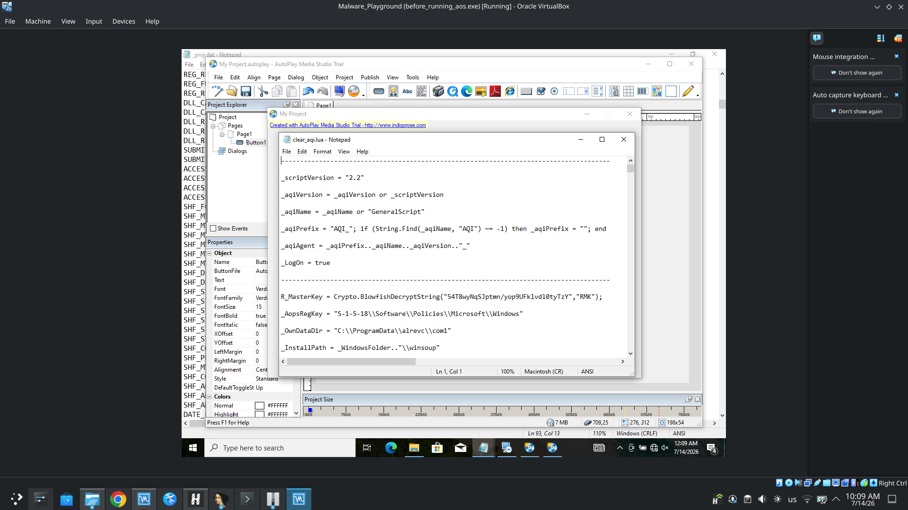

## Preface

Two weeks ago I had a flight to Moscow. As usual I picked few videos from YouTube to kill time. But, during the watch, one video caught my attention. It was something about our childhood bloggers (didn't know any of them but never mind), who turned out to be criminals. And the thing that piqued my interest, is that one of this childhood bloggers, made a 
'manager' that actually was malware (RAT to be more clear). Interesting right?
Well..I think It's time to dust off my Windows VM..

## Running the manager

Upon launching the executable, we are greeted with a main screen. To log in we need some PIN, so let's pass registration first. It asks for VK and Telegram usernames and an avatar. But aside from the standard input fields, there is a very interesting form asking questions like: _"Is this a PC or a laptop?"_ and _"Is it a personal or a family computer?"_

Ah yes, looks completely legitimate! They are just curious 100%  ^^

We proceed with fake data, but instead of logging in, we hit a wall: a notification stating our account is under "manual review." From what previous victims reported on forums, the attackers would literally check the provided Telegram handle, message the victim, and give them a specific PIN code required to log in. Or maybe attack starts even after registration? Gonna figure it out.

Another crucial detail: **Windows Defender is completely silent.** It doesn't flag the initial executable at all. This strongly implies that the file we have is just a dropper or a stub, and it either downloads the malicious payload later or uses legitimate tools to evade detection. Victims mentioned remote access (RAT) capabilities, but since the threat actors are likely inactive now, entering the right code probably won't ruin my VM anyway(((
Still, let's dive deeper.

## Analyzing

### Dematryoshking (Unpacking)

First things first, let's throw the malware into DiE (Detect It Easy).

We see a suspiciously large overlay, and it's packed with `UPolyX`. I ran ProcMon and Task Manager, and saw interesting detail:

It turns out `UPolyX` wasn't unpacking the actual malware logic - it was unpacking an installer engine! Specifically, AutoPlay Media Studio (AMS).

The engine silently drops a file named `autorun.exe` into the `%TEMP%\ir_ext_temp_4` directory (a standard temp folder for AutoPlay Media Studio). Alongside it, we get a bunch of resource files: `aqi.res`, `aop.res`, `data.res`, plus some icons and music files. 

So, `autorun.exe` is just a benign runner. To get to the real juice, we need to extract the scripts it interprets.  I downloaded an unpacker for AutoPlay Media Studio, unpacked `autorun.exe`, and finally got my hands on the source code. Also tried to open .res files, but they are pure gibberish, maybe encrypted.

It's written in LuaScript (a custom dialect of Lua created by Indigo Rose). Scrolling through it, it looks almost entirely legitimate - just mechanics for buttons, UI pages, and generic logic. _Almost._ Why almost?)

Oh, right at the top of the file, three highly suspicious strings.

A quick trip to CyberChef and a simple ROT13 decryption reveals the truth.

The script decrypts a string into a variable `z`. Then, it uses `z` as a key to decrypt the `aqi.res` file and immediately executes its contents in memory. 
Given this level of stealth, `aqi.res` definitely doesn't contain a cute background MIDI track.

### Decrypting

We need to decrypt `aqi.res` to see what it's doing. But here's the problem: we are dealing with ancient (well, a bit), proprietary LuaScript cryptography. Porting that decryption algorithm to Python would be tedious and time-consuming.

So, I decided to work smarter, not harder. I simply downloaded AutoPlay Media Studio myself and created a quick, super duper cool app with a whole button (PRO level of programming, sure)! That contained exact decryption routine.

Click the button, and boom! Magic! The decrypted file drops right into the folder. Now we have `aqi.lua`.
### AQI main logic

Analyzing `aqi.lua`, it becomes clear that this is the primary scout and dropper. Its main responsibilities are:

- **Evasion:** It checks for the presence of Antiviruses and looks for virtual machine artifacts to avoid analysis.
    
- **Recon:** It gathers basic telemetry about the infected device.
    
- **Environment Setup:** It modifies folder permissions to secure its payload.
    
- **Dropping Payloads:** It unpacks an archive containing its "friends" into two newly created directories.

The two directories are `\alrevc\com1` (used to store logs and basic device info) 

RUD.txt - report user data (or something like that)

And `\winsoup`, which houses the encrypted payloads: `aop.exe`, `aops.exe`, `aopr.exe`, and `arc.exe` (internally referred to as "Ally"). 

Family reunion)))

Finally, the script executes `aop.exe`.

### AOP main logic

Since the encryption algorithm and the key were exactly the same, I used my custom AMS app to decrypt `aop.res` and `data.res` as well.

Unpacking `aop.exe` yields yet another Lua script. This malware is basically a matryoshka, well, the creator is from Russia... 
Back to logic: 
#### Privilege Escalation: The NirCmd Abuse

A crucial part of `AOP`’s environment preparation is ensuring it has the ability to operate with high privileges without raising suspicion. To achieve this, the malware abuses a legitimate utility: **NirCmd**.

The logic is handled by an `InstallNir` function. It checks for the presence of the `NirCmd` stub in the resources, decrypts it using the ubiquitous `R_MasterKey` and `Blowfish` algorithm, and drops it into `C:\ProgramData\NirCmd\nircmd.exe`.

With the tool in place, the malware uses a wrapper strategy to execute commands throughout its lifecycle:

- **`RunAsSystem`**: Uses `elevatecmd runassystem` to launch processes with `SYSTEM` privileges.
    
- **`ElevatedRun`**: Uses `elevate` or `elevatecmd exec hide` to trigger UAC or run tasks silently.
    
- **`ElevatedCommand`**: Executes arbitrary system commands in a hidden, elevated state.

As you can see, `aop.exe` serves as a staging and health-check phase before launching the actual malware. It is heavily armored with precautions: it verifies that none of its required components have been deleted (e.g., by an AV), resets permissions, prepares the environment, and finally launches `aops.exe` and `arc.exe` (Ally).

### Ally & AOPS main logic

This is where the actual persistence, surveillance, and remote control mechanisms live.

`aops.exe` acts as the system's "Bodyguard." It masks itself as a Windows service to establish persistence on the machine. Its primary job is to watch over `aop.exe` and `arc.exe` (or rather, the scripts they interpret). If the user or a security solution terminates them, the bodyguard is ready to instantly restore and relaunch them. Furthermore, `aops.exe` is the executor. It receives commands sent by Ally and executes them on the infected system.

**Ally (`arc.exe` / `arc.cdd`)**, on the other hand, is the core of the RAT.  Here is the main malicious logic: 

- **Obfuscation & Storage:** It relies on our friend, ROT13 for string hiding. For example, the string `P:\\CebtenzQngn\\nyerip\\pbz1` is decoded on the fly to `C:\ProgramData\alrevc\com1`, which serves as their primary working directory. It also stashes a Master Key (`E_MasterKey` or `R_MasterKey`) in the registry at `S-1-5-18\Software\Policies\Microsoft\Windows` to decrypt sensitive data using Blowfish with the same master key, as for .res files.
    
- **Aggressive AV-Shield:** The script disables file system redirection using `Wow64.DisableFsRedirection()` to ensure it sees the real x64 system directories. It then sets up aggressive timers (`tAntivirCheck`, `tAVShield-Process`, `tAVShield-Pattern`) that actively hunt for and kill antivirus processes. If AV windows are detected, the scan frequency drops to a manic 3 seconds. It also runs a `KillOtherInstance()` function to prevent multiple instances from triggering behavioral alerts. Also it kills Torrents(((

Search list:

Blocking Antiviruses:

- **Surveillance Modules:** Classic RAT behavior is managed through several specific timers: `tWebCamCapture` (for stealthy webcam snapshots) and `tDemonstration` (screen streaming). But the strangest one is `tPrnSearch` - it actively scans active window titles for porn-related keywords. If it finds a match, it immediately increases the frequency of its keylogging and screen capturing, also sending to C2 server. I think they used it for blackmailing.  One victim shared one of the Geese bloggers asked them to sent 10 private photos in Telegram, in exchange for restoring the system. I think it's the scariest part, because their subs were mostly teenagers. 

Function that gathers "compromising material":

Rot13 again:

Send all materials to the server:

    
- **Self-Updating:** Through a function called `AllyCodeUpdate`, the malware reaches out via FTP to download a new `arc.cdd` file, verifies its MD5 hash, and seamlessly replaces its own code.

### Connecting the dots

If we take a step back, the architecture of this malware is a textbook example of "Living off the Land" (LotL) combined with a modular approach:

1. **The Wrapper:** A harmless-looking executable drops an AutoPlay Media Studio runner.
    
2. **The Scout (`AQI`):** Uses legitimate AMS scripting to bypass Defender, check the environment, and drop the encrypted payloads.
    
3. **The Manager (`AOP`):** Validates the integrity of the malware components.
    
4. **The Muscle (`AOPS & Ally`):** Establishes a persistent Windows service, protects the malware from deletion, and executes remote commands.

Instead of writing a massive, easily detectable C++ malware from scratch, the Empire of Geese blogger (or whoever wrote this for them) built a Matryoshka RAT monster out of legitimate engines and scripts. It’s incredibly effective at bypassing standard static analysis. But personally, I loved to analyze it so much <3

## Conclusion & IOCs

What started as watching a brain rot reaction to video about a childhood bloggers turned into a fascinating dive into modular malware architecture. GLmanager is a great reminder that such criminals don't always need sophisticated zero-days to compromise a machine; sometimes, a custom wrapper around a 20-year-old media studio engine is more than enough to stay under the radar. 
And hey, check your webcam shutter)
